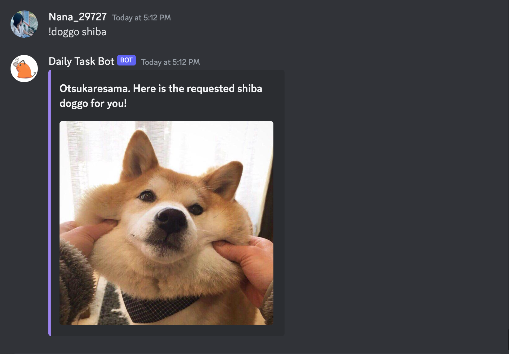
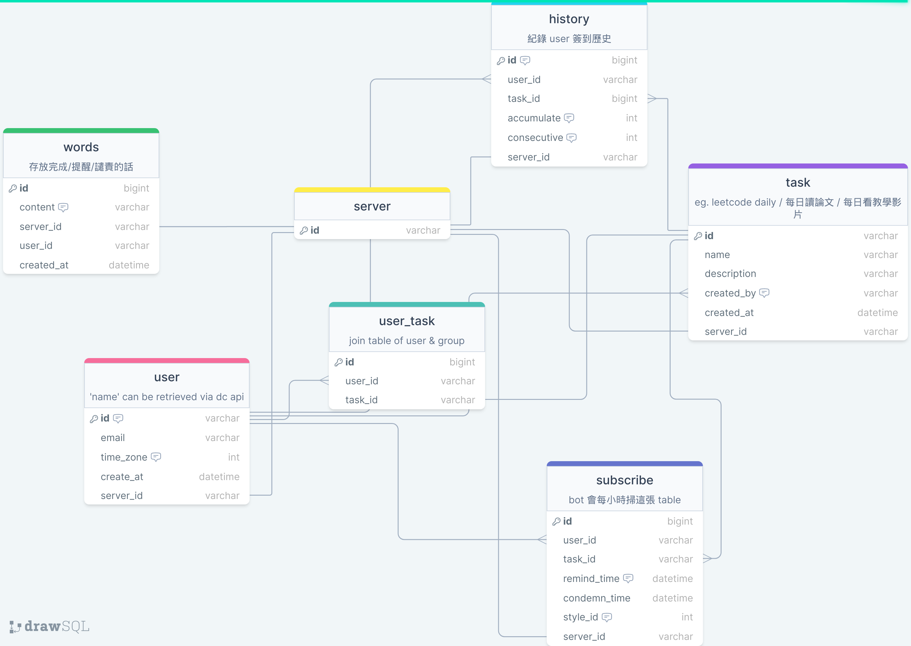

# 🤖 Discord Daily Task Bot
<!-- todo: 補上下 command 時的圖片 -->

## Story & Purpose
The [leetcode-challenge-bot](https://github.com/CodingSheep1229/leetcode-challenge-bot) once served the Discord Server 🥘 Leetcode 涮涮鍋 loyally to remind the members of the server to do the daily leetcode challenge, now it is torn down because the hosted server provider starts charging fees. Moreover, We have been thinking of creating a more general bot that can remind the members of the server to do their daily tasks with more interactive features, hence the **🤖 Daily Task Bot** was born.

## Language
The bot's commands are written mainly in **Chinese**.

The bot is developing under **Python 3.8.16**.

## Features

Apart from the basic features already provided in the template, **🤖 Daily Task Bot** has the following features:

### `!register`
In order for our Daily Task Bot to remind you on a daily basis, it has to first know your time zone. This command's main purpose is to allow you to register your time zone to facilitate the commands listed in `!daily`.

### `!daily` 每日任務管理小幫手
```
>> !daily
    # 新增刪除與顯示可簽到任務
    - add      # ✅
    - listall  # ✅
    - listmine # ✅
    - delete   # ✅
    # 簽到與簽到提醒功能
    - done        # ✅
    - listdone   # ✅
    - subscribe   # ✅
    - unsubscribe # ✅
```
1. `add` and `delete`:
    To add a daily task, you can use `!daily add` to add the task to the database. The bot will then ask you to enter the task name, the task description and the relevant url. You can only `!daily delete` the tasks you created.
2. `listall`and `listmine`:
    `listall` lists all the tasks in the database; `listmine` lists all the tasks that you've *cretaed* to the database.
3. `done`:
    To add a check mark ✅ in the task that you've *done* today. Similar to `!daily` in [leetcode-challenge-bot](https://github.com/CodingSheep1229/leetcode-challenge-bot).
4. `listdone -n`:
    To list all the tasks that you've *done* recently. `-n` is the number of days you want to list. For example, `!daily listdone -3` will list the recent 3 tasks that you've done. Not specifying `-n` will list all the tasks that you've done.
5. `subscribe` and `unsubscribe`:
    To subscribe to the daily task reminder for a particular daily task. The bot will send you a reminder at the reminding time given your registered timezone.  To unsubscribe from the daily task reminder for a particular daily task, provided that you've subscribed to it.


### `!words` 增加鼓勵/譴責字彙
```
>> !words
    - add      # ✅
    - delete   # ✅
    - list     # ✅
    - listmine # ✅
```
The `!words` command is used to add, delete and list the words that you would like to see when being reminded or condemned by **🤖 Daily Task Bot**. The words are stored in the database and will be randomly selected when being reminded or condemned. The [leetcode-challenge-bot](https://github.com/CodingSheep1229/leetcode-challenge-bot) has similar features but it does not exposed the API to add, delete and list the words.

### `!doggo`

`!doggo` command will send a random dog picture to the channel from the API [Dog CEO](https://dog.ceo/dog-api/).
You can add a `{breed}` command after `!doggo` to get a random dog picture of the breed you specified. For example, `!doggo shiba` will send a random shiba picture. For breed name that has spaces in between, simply `!doggo golden retriever` will do the trick.
#  daily 錄影長一點





## Invitation Link
[invitation link](https://discordapp.com/oauth2/authorize?&client_id=1073453945688698970&scope=bot+applications.commands&permissions=8)

## Template
We use the template published by @kkrypt0nn on GitHub. You can find it [here](https://github.com/kkrypt0nn/Python-Discord-Bot-Template). The repository is under Apache 2.0 license.

## Implementation Details
- [⛏ tech spec](https://hackmd.io/rPEiqT5rSDOqIbWgoaPX5A)
- [🗺 database schema](https://drawsql.app/teams/leetcode-bot/diagrams/db/embed)
- services:
    - Database: PostgreSQL; docker image (`postgis/postgis:13-master`)
    - Database Management CMS: Directus; docker image (`directus/directus:latest`)
    - Directus's Cache: Redis; docker image（`redis:6`）
- Making sure your `port` is not occupied; then use `docker-compose up -d` to start the services.
- After a successful docker compose up, Go to `localhost:8056` to access the Directus CMS. The ports could be changed in `docker-compose.yaml`.


## TODO & Future Works
- [] `!daily delete` 要檢查該任務是否有其他 subscribers，如果有的話則不可以刪除，並跳出警告訊息。
- [] `!daily subscribe` 譴責和提醒只在當日該任務尚未完成時才啟動。

## Thanks
**🤖 Daily Task Bot** is improved based on our LeetCode partner [CodingSheep1229](https://github.com/CodingSheep1229)'s [leetcode-challenge-bot](https://github.com/CodingSheep1229/leetcode-challenge-bot). Its features are inspired by [2023 TSMC CareerHack's 3rd-place solution](https://github.com/yiting-tom/TSMC-careerhack-2023-3rd-place-solution), in which [eric88525](https://github.com/eric88525) is one of the contributors. We would like to thank them for their contributions to the open-source community.
